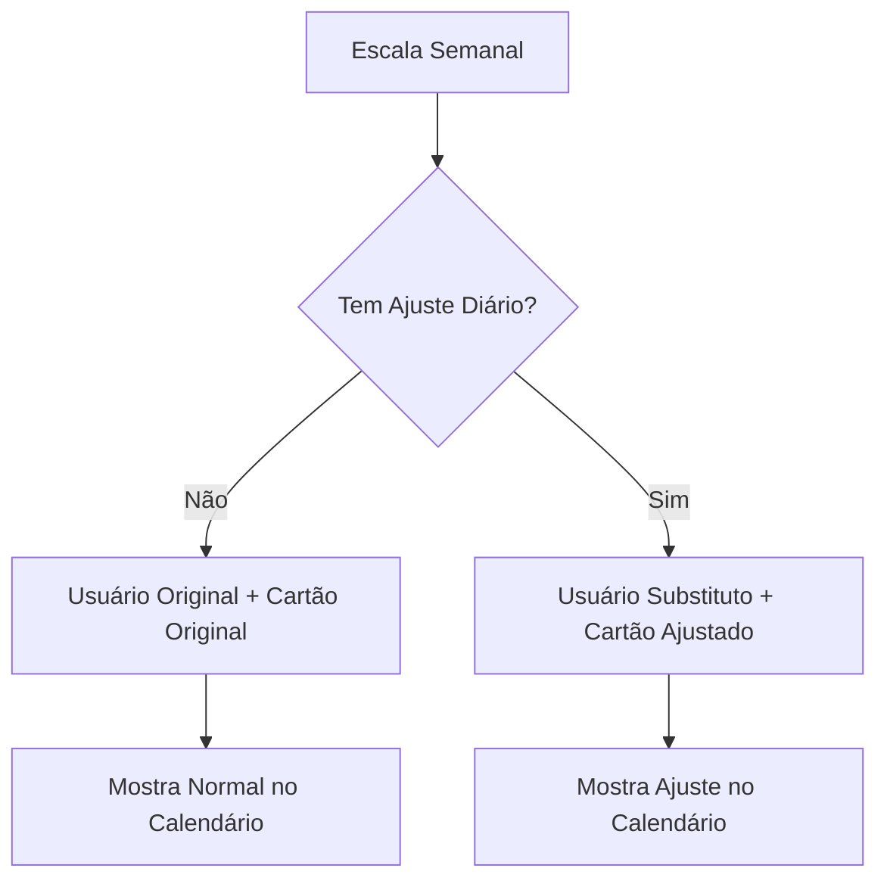

# 📅 Funcionalidade: Escala Diária

## 🎯 **Objetivo**
Permitir ajustes diários na escala semanal quando pessoas não puderem trabalhar no dia programado, facilitando substituições e mudanças de cartões programa específicos para determinados dias.

## 🏗️ **Estrutura Implementada**

### **📊 Tabela: `escala_diaria`**
```sql
CREATE TABLE escala_diaria (
    id                    BIGINT UNSIGNED PRIMARY KEY AUTO_INCREMENT,
    data                  DATE NOT NULL,                  -- Data específica do ajuste
    escala_original_id    INT UNSIGNED NOT NULL,          -- Referência à escala semanal
    usuario_original_id   INT UNSIGNED NOT NULL,          -- Usuário originalmente escalado
    usuario_substituto_id INT UNSIGNED NOT NULL,          -- Usuário substituto
    posto_trabalho_id     INT UNSIGNED NOT NULL,          -- Posto de trabalho
    cartao_programa_id    BIGINT UNSIGNED NULL,           -- Cartão programa específico
    motivo                TEXT NULL,                      -- Motivo da substituição
    status                ENUM('ativo', 'cancelado') DEFAULT 'ativo',
    criado_por            INT UNSIGNED NOT NULL,          -- Admin que fez a alteração
    created_at            TIMESTAMP NULL,
    updated_at            TIMESTAMP NULL,
    
    INDEX(data, status),
    INDEX(posto_trabalho_id, data),
    INDEX(escala_original_id),
    INDEX(usuario_original_id),
    INDEX(usuario_substituto_id)
);
```

### **🎭 Model: `EscalaDiaria`**
```php
class EscalaDiaria extends Model
{
    // Relacionamentos completos
    public function escalaOriginal()      // → Escala
    public function usuarioOriginal()     // → Usuario
    public function usuarioSubstituto()   // → Usuario
    public function postoTrabalho()       // → PostoTrabalho
    public function cartaoPrograma()      // → CartaoPrograma
    public function criadoPor()           // → Usuario
    
    // Método principal para obter escala efetiva
    public static function getEscalaEfetiva($data, $postoId = null)
    // Retorna escalas semanais + ajustes diários aplicados
}
```

### **🎮 Controller: `EscalaDiariaController`**
```php
class EscalaDiariaController extends Controller
{
    public function index()        // Calendário principal
    public function calendario()   // API: dados de um dia específico
    public function store()        // Criar ajuste diário
    public function update()       // Editar ajuste existente
    public function destroy()      // Cancelar ajuste (soft delete)
    public function cartoesPrograma() // API: cartões por posto
}
```

## 🖥️ **Interface do Usuário**

### **📅 Calendário Interativo**
- **Navegação:** Setas para mês anterior/próximo + botão "Hoje"
- **Indicadores Visuais:**
  - 🟢 **Verde:** Dia atual
  - 🔵 **Azul:** Dias com ajustes (mostra número de ajustes)
  - 🔘 **Cinza:** Dias normais
  - 🔲 **Claro:** Dias de outros meses

### **⚡ Funcionalidades Principais**

#### **1. Visualizar Escalas do Dia**
- Clique em qualquer dia → Modal com escalas daquele dia
- Mostra usuário efetivo (original ou substituto)
- Indica se há ajuste aplicado
- Exibe cartão programa ativo

#### **2. Criar/Editar Ajustes**
- Botão "Ajustar" em escalas normais
- Botão "Editar" em escalas já ajustadas  
- Formulário com:
  - **Usuário Substituto** (obrigatório)
  - **Cartão Programa** (opcional - mantém original se não alterado)
  - **Motivo** (opcional - ex: "Licença médica")

#### **3. Cancelar Ajustes**
- Botão "Cancelar" em escalas ajustadas
- Confirmação antes de cancelar
- Volta à escala semanal original

## 🔄 **Fluxo de Funcionamento**

### **Como Funciona a Lógica:**



### **Método `getEscalaEfetiva()` - Coração do Sistema:**
1. **Busca escalas semanais** para o dia da semana
2. **Busca ajustes diários** ativos para a data específica
3. **Aplica ajustes** às escalas semanais (substitui usuário/cartão)
4. **Retorna escalas efetivas** (já com substituições aplicadas)

## 🎛️ **Menu e Navegação**

### **Item do Menu:**
```html
<li class="nav-item">
    <a class="nav-link {{ request()->is("admin/escala-diaria*") ? "active" : "" }}" 
       href="{{ route("admin.escala-diaria.index") }}">
        <i class="fas fa-calendar-day me-2"></i>
        Escala Diária
    </a>
</li>
```

### **Rotas Criadas:**
```php
Route::get('escala-diaria', [...]);                    // Calendário
Route::get('escala-diaria/calendario', [...]);         // API: dia específico  
Route::post('escala-diaria', [...]);                   // Criar ajuste
Route::put('escala-diaria/{escalaDiaria}', [...]);     // Editar ajuste
Route::delete('escala-diaria/{escalaDiaria}', [...]);  // Cancelar ajuste
Route::get('escala-diaria/cartoes-programa', [...]);   // API: cartões por posto
```

## 🎯 **Casos de Uso Práticos**

### **Exemplo 1: Vigilante com Licença Médica**
1. **Situação:** João (vigilante) tem licença médica na quarta-feira
2. **Ação:** Admin acessa calendário → clica na quarta-feira → ajusta escala de João
3. **Substituto:** Seleciona Pedro como substituto + mantém mesmo cartão programa
4. **Resultado:** Na quarta-feira, Pedro trabalha no lugar de João

### **Exemplo 2: Mudança de Horário Específica**
1. **Situação:** Maria precisa trocar de turno apenas na sexta-feira
2. **Ação:** Admin ajusta escala de Maria → substitui por Ana + muda cartão programa
3. **Resultado:** Sexta-feira: Ana trabalha com cartão programa diferente

### **Exemplo 3: Cancelamento de Ajuste**
1. **Situação:** João volta do atestado antes do previsto
2. **Ação:** Admin cancela ajuste de quinta-feira
3. **Resultado:** João volta a trabalhar normalmente na quinta-feira

## 🔮 **Integração com App-Vigilante**

### **Próximo Passo: Ajustar API do App-Vigilante**
```php
// Em vez de buscar apenas escalas semanais:
$escalas = Escala::where('usuario_id', $vigilanteId)->get();

// Usar o novo método que considera ajustes diários:
$escalasEfetivas = EscalaDiaria::getEscalaEfetiva(today(), $postoId);
```

## 📊 **Benefícios da Implementação**

### ✅ **Para Administradores:**
- **Flexibilidade:** Ajustes rápidos sem alterar escala semanal
- **Rastreabilidade:** Histórico de mudanças com motivos
- **Visual:** Calendário intuitivo mostra status de cada dia

### ✅ **Para Vigilantes (App-Vigilante):**
- **Precisão:** Veem cartões programa corretos para cada dia
- **Atualização:** Informações sempre atualizadas com ajustes

### ✅ **Para o Sistema:**
- **Integridade:** Escalas semanais preservadas
- **Auditoria:** Quem fez qual mudança e quando
- **Performance:** Índices otimizados para consultas frequentes

## 🚀 **Como Usar**

### **1. Acessar Escala Diária:**
```bash
http://localhost:8000/admin/escala-diaria
```

### **2. Fazer Ajuste:**
1. Clique no dia desejado no calendário
2. Na escala que precisa ajustar, clique "Ajustar"
3. Selecione usuário substituto
4. (Opcional) Altere cartão programa
5. (Opcional) Adicione motivo
6. Clique "Salvar Ajuste"

### **3. Cancelar Ajuste:**
1. Clique no dia com ajuste (destacado em azul)
2. Na escala ajustada, clique "Cancelar"
3. Confirme a operação

---

**Status:** ✅ **CONCLUÍDO** - Funcionalidade completa e pronta para uso!

**Próximo Passo:** Integrar com app-vigilante para exibir cartões programa corretos baseados nos ajustes diários. 