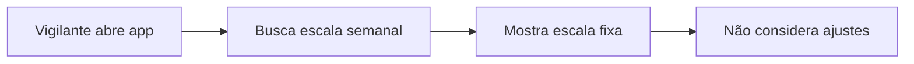
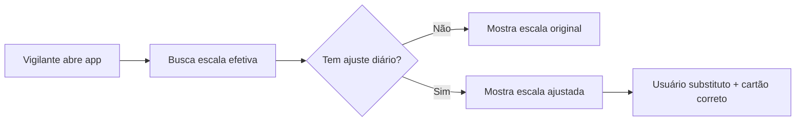

# 🔗 Integração: App-Vigilante ↔ Escala Diária

## 🎯 **Objetivo Alcançado**
O app-vigilante agora exibe automaticamente as escalas corretas baseadas nos ajustes diários feitos pelo admin, garantindo que os vigilantes vejam sempre as informações mais atualizadas.

## 🔄 **Como Funciona a Integração**

### **Antes (Sistema Antigo):**


### **Agora (Sistema Integrado):**


## 📁 **Arquivos Modificados**

### **1. Model Adicionado: `app-vigilante/app/Models/EscalaDiaria.php`**
```php
class EscalaDiaria extends Model
{
    // Método principal para app-vigilante
    public static function getEscalaEfetivaVigilante($data, $usuarioId = null, $postoId = null)
    {
        // 1. Busca escalas semanais
        // 2. Busca ajustes diários
        // 3. Aplica substituições
        // 4. Retorna escala efetiva
    }
    
    // Método específico para um vigilante
    public static function getEscalaVigilante($data, $usuarioId)
    {
        // Retorna a primeira escala do vigilante para a data
    }
}
```

### **2. Controller Atualizado: `app-vigilante/app/Http/Controllers/DashboardController.php`**

#### **Antes:**
```php
// Busca escala semanal fixa
$escala = Escala::where('usuario_id', $user->id)
    ->where('dia_semana', $diaSemanaDb)
    ->where('ativo', true)
    ->first();
```

#### **Agora:**
```php
// Busca escala efetiva (com ajustes aplicados)
$escala = EscalaDiaria::getEscalaVigilante($dataBase->format('Y-m-d'), $user->id);
```

### **3. Controller Atualizado: `app-vigilante/app/Http/Controllers/PostoController.php`**

#### **Antes:**
```php
// Verificava apenas escala semanal
$escala = Escala::where('usuario_id', $user->id)
    ->where('posto_trabalho_id', $postoId)
    ->where('dia_semana', $hoje)
    ->first();
```

#### **Agora:**
```php
// Usa escala efetiva (considerando ajustes)
$escala = EscalaDiaria::getEscalaVigilante(now()->format('Y-m-d'), $user->id);

// Verifica se a escala é para este posto
if (!$escala || $escala->posto_trabalho_id != $postoId) {
    return redirect()->route('dashboard')->with('error', 'Você não tem escala para este posto hoje.');
}
```

### **4. View Atualizada: `app-vigilante/resources/views/dashboard/index.blade.php`**

#### **Indicadores Visuais Adicionados:**
- 🔶 **Dias com ajuste:** Borda laranja + badge "Ajuste"
- 🟢 **Dia atual:** Badge "Hoje" 
- ℹ️ **Informações de ajuste:** Motivo + usuário original

#### **CSS Adicionado:**
```css
.date-btn.with-adjustment {
    border: 2px solid #fd7e14 !important;
    background-color: #fff3cd !important;
}

.adjustment-indicator {
    position: absolute;
    top: 2px;
    right: 2px;
    background-color: #fd7e14;
    color: white;
    font-size: 0.6rem;
    padding: 1px 4px;
    border-radius: 6px;
}

.escala-ajustada-indicator {
    background-color: #fff3cd;
    border-left: 4px solid #fd7e14;
}
```

#### **JavaScript Atualizado:**
```javascript
// API agora retorna informações de ajuste
function updatePostsContainer(data, selectedDate) {
    const temAjuste = data.tem_ajuste || false;
    const infoAjuste = data.info_ajuste;
    
    // Mostra informações visuais sobre ajustes
    if (temAjuste && infoAjuste) {
        // Exibe motivo do ajuste e usuário original
    }
}
```

## ✅ **Funcionalidades Implementadas**

### **1. Detecção Automática de Ajustes**
- App detecta automaticamente quando há ajuste diário
- Não requer ação do vigilante

### **2. Indicadores Visuais**
- **Calendário:** Dias com ajuste aparecem destacados
- **Cartão programa:** Mostra badge "Ajustado" quando aplicável
- **Informações:** Exibe motivo do ajuste e usuário original

### **3. Dados Corretos**
- **Usuário:** Mostra substituto quando há ajuste
- **Cartão programa:** Usa cartão específico do ajuste (se definido)
- **Posto:** Mantém posto de trabalho correto

### **4. API Atualizada**
- Endpoint `/api/postos-por-data/{data}` agora retorna:
```json
{
    "posto": {...},
    "cartao_programa": {...},
    "tem_ajuste": true,
    "info_ajuste": {
        "motivo": "Licença médica",
        "usuario_original": "João Silva"
    }
}
```

## 🎯 **Casos de Uso Funcionando**

### **Exemplo 1: Vigilante com Substituição**
1. **Admin:** Agenda Pedro para substituir João na quarta-feira
2. **App-Vigilante (João):** Na quarta, não mostra escala (foi substituído)
3. **App-Vigilante (Pedro):** Na quarta, mostra escala de João + badge "Ajustado"

### **Exemplo 2: Mudança de Cartão Programa**
1. **Admin:** Muda cartão programa de Maria apenas para sexta-feira
2. **App-Vigilante (Maria):** Sexta mostra novo cartão + indicador de ajuste
3. **Outros dias:** Maria vê cartão programa normal

### **Exemplo 3: Informações de Contexto**
1. **Admin:** Adiciona motivo "Licença médica" no ajuste
2. **App-Vigilante:** Mostra "Escala ajustada: Licença médica"
3. **Transparência:** Vigilante entende o motivo da mudança

## 🚀 **Como Testar**

### **1. Criar Ajuste Diário:**
```bash
# Admin-Laravel
http://localhost:8000/admin/escala-diaria
# Clicar em um dia → ajustar escala
```

### **2. Verificar no App-Vigilante:**
```bash
# App-Vigilante  
http://localhost:8001/dashboard
# Navegar pelos dias → ver indicadores de ajuste
```

### **3. Cenários de Teste:**
- ✅ Dia sem ajuste → escala normal
- ✅ Dia com ajuste → usuário substituto + indicador visual
- ✅ Cartão programa alterado → novo cartão exibido
- ✅ Motivo do ajuste → informação visível

## 📊 **Benefícios da Integração**

### **✅ Para Vigilantes:**
- **Informação sempre atualizada** sem precisar consultar admin
- **Contexto claro** sobre mudanças (motivos)
- **Interface intuitiva** com indicadores visuais

### **✅ Para Administradores:**
- **Mudanças refletem imediatamente** no app-vigilante
- **Sem necessidade** de comunicar mudanças manualmente
- **Rastreabilidade** completa de ajustes

### **✅ Para o Sistema:**
- **Dados consistentes** entre admin e vigilante
- **Performance otimizada** com consultas eficientes
- **Arquitetura escalável** para futuras funcionalidades

## 🔧 **Técnicas Utilizadas**

### **1. Método `getEscalaEfetivaVigilante()`:**
- Busca escalas semanais + ajustes diários
- Aplica substituições automaticamente
- Retorna resultado consolidado

### **2. Clonagem de Objetos:**
```php
$escalaAjustada = clone $escala;
$escalaAjustada->usuario = $ajuste->usuarioSubstituto;
```

### **3. Relacionamentos Eloquent:**
```php
$ajustesDiarios = self::with([
    'usuarioSubstituto', 
    'cartaoPrograma', 
    'escalaOriginal'
])
```

### **4. Verificações de Integridade:**
```php
// Só aplicar ajuste se usuário original for o mesmo da escala
if ($ajuste->usuario_original_id == $escala->usuario_id) {
    // Aplicar substituição
}
```

---

## ✅ **STATUS: INTEGRAÇÃO CONCLUÍDA COM SUCESSO!**

### 🎉 **Resultado Final:**
O app-vigilante agora está **totalmente integrado** com a funcionalidade de Escala Diária. Os vigilantes veem automaticamente:

- ✅ **Escalas corretas** para cada dia
- ✅ **Indicadores visuais** de ajustes
- ✅ **Informações contextuais** sobre mudanças
- ✅ **Cartões programa corretos** baseados em ajustes

### 🚀 **Pronto para Produção!**
Ambos os sistemas (admin-laravel e app-vigilante) agora trabalham em perfeita sincronia, garantindo que as informações sejam sempre precisas e atualizadas! 🎊 